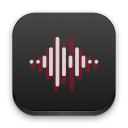
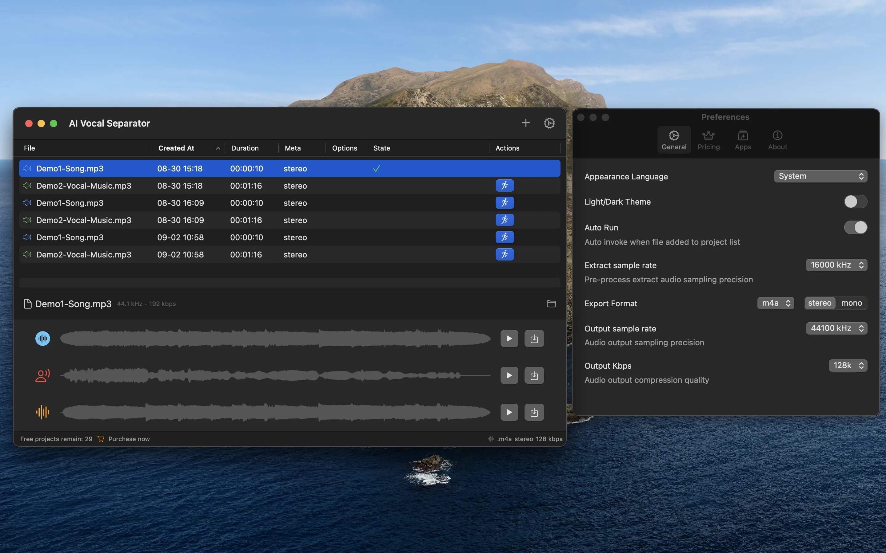
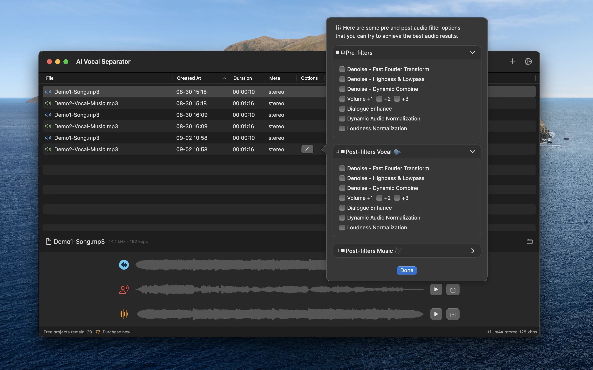

# README.md
- [Deutsch](README.de.md)
- [English](README.md)
- [Spanish](README.es.md)
- [French](README.fr.md)
- [Italian](README.it.md)
- [언어](README.ko.md)
- [日本語](README.ja.md)
- [简体中文](README.zh_cn.md)
- [繁体中文](README.zh_tw.md)

# Vocal Separator - Separador de voces por lotes con modelo de IA local

Descargue [la última versión desde la App Store de macOS](https://apps.apple.com/us/app/id6670239953).

V1.0
---
La característica principal es separar las pistas de voces y música de fondo de archivos de video o audio.
Todas las operaciones se realizan localmente usando un modelo de IA, sin necesidad de subir archivos, lo que garantiza la privacidad personal.

Características:
- Soporta el procesamiento por lotes de archivos de video y audio para mejorar la eficiencia.
- Permite diferentes operaciones de filtrado en las pistas de audio o separadas, como la reducción de ruido y la Transformada Rápida de Fourier.
- Para archivos de video, permite reemplazar la pista de audio original con la pista vocal o música de fondo separada después de la separación.

## Características

