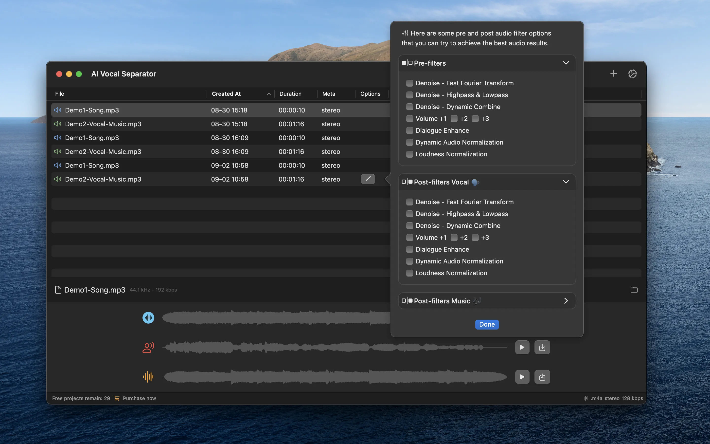

# README.md
- [Deutsch](README.de.md)
- [English](README.md)
- [Spanish](README.es.md)
- [French](README.fr.md)
- [Italian](README.it.md)
- [언어](README.ko.md)
- [日本語](README.ja.md)
- [简体中文](README.zh_cn.md)
- [繁体中文](README.zh_tw.md)

# Vocal Separator - Batch vocal separator with local AI model

Download [the latest release from macOS appstore](https://apps.apple.com/us/app/id6670239953)

V1.0
---
Key feature is separate vocal and background music tracks from video or audio files. 
All operations are performed locally using AI Model, with no need to upload any files, ensuring personal privacy.

Features:
- Supports batch processing of video and audio files to enhance efficiency.
- Allows different filtering operations on audio or separated tracks, such as noise reduction and Fast Fourier Transform.
- For video files, it supports replacing the original audio track with the separated vocal or background music after separation.

## Features

