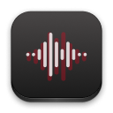
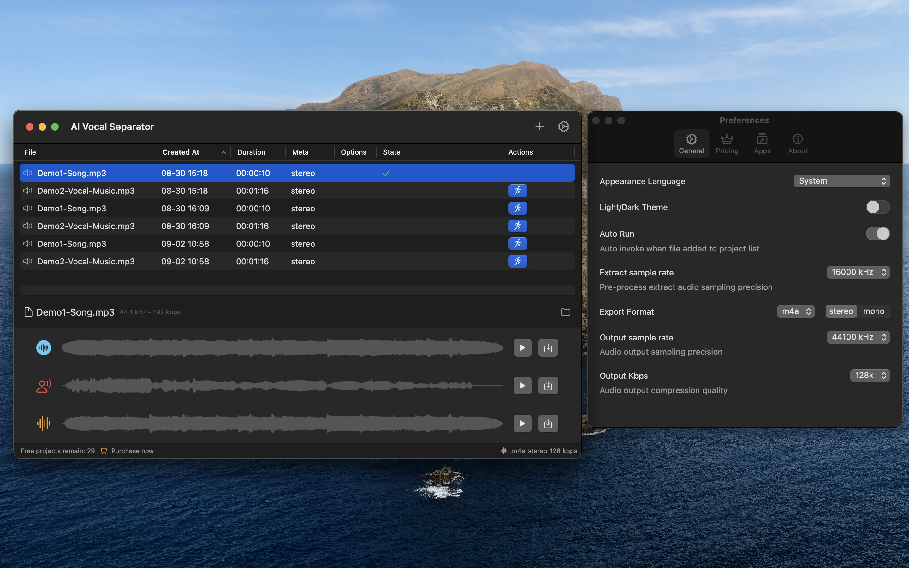

# README.md
- [Deutsch](README.de.md)
- [English](README.md)
- [Spanish](README.es.md)
- [French](README.fr.md)
- [Italian](README.it.md)
- [언어](README.ko.md)
- [日本語](README.ja.md)
- [简体中文](README.zh_cn.md)
- [繁体中文](README.zh_tw.md)

# Vocal Separator - 批量人聲分離器，使用本地AI模型

下載[macOS應用程式商店中的最新版本](https://apps.apple.com/us/app/id6670239953)

V1.0
---
主要功能是從視頻或音頻文件中分離人聲和背景音樂軌道。
所有操作均在本地使用AI模型完成，無需上傳任何文件，確保個人隱私。

功能特色:
- 支援批量處理視頻和音頻文件，提高效率。
- 允許對音頻或分離後的音軌進行不同的過濾操作，如降噪和快速傅里葉變換。
- 對於視頻文件，支援在分離後將原始音軌替換為分離出的人聲或背景音樂。

## 功能

